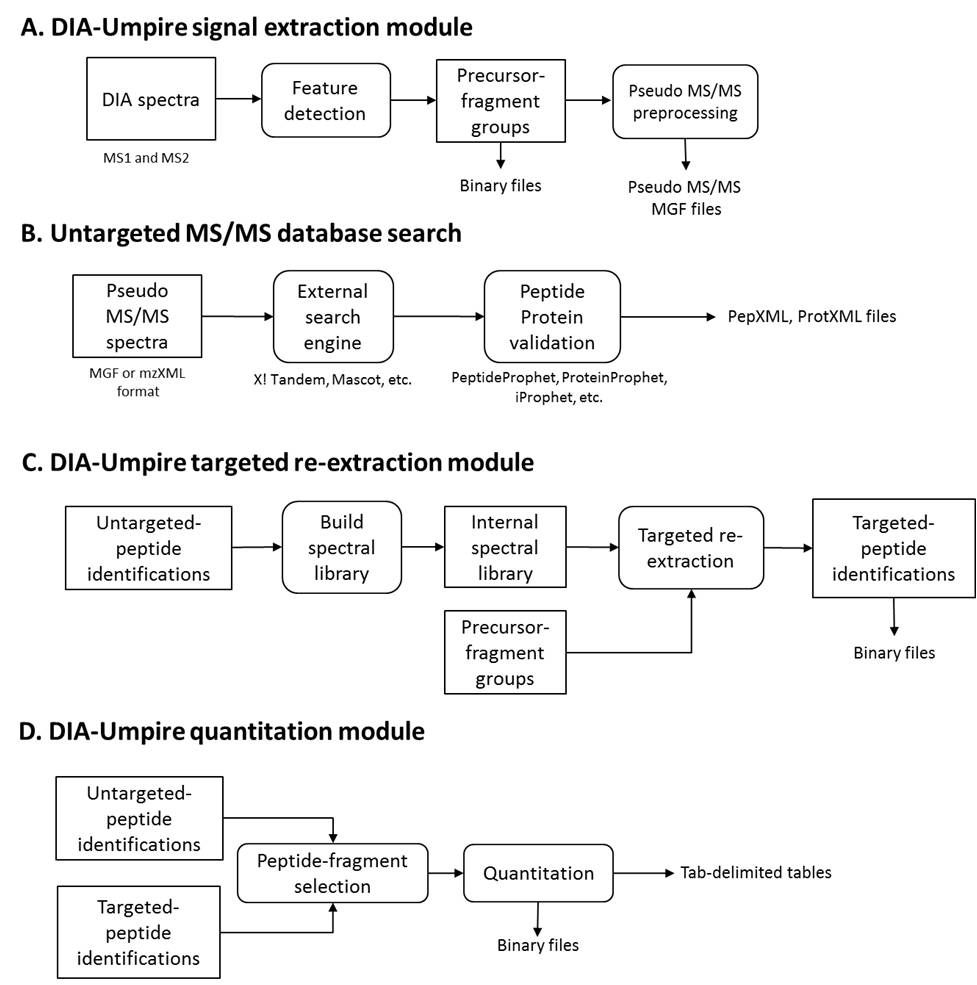

DIA-Umpire is an open source Java program for computational analysis of data independent acquisition (DIA) mass spectrometry-based proteomics data. It enables untargeted peptide and protein identification and quantitation using DIA data, and also incorporates targeted extraction to reduce the number of cases of missing quantitation. 

 

# Four Major Modules

 
 
 

# Suggested workflow
Depending on the scale of applications, we describe here differentapplication scenarios which require different combinations of DIA-Umpire modules

1. Identification only analysis (Steps A->B)

2. Small scale identification and quantitation analysis with minimal computational costs (Steps A->B->D)

3. Complete DIA-Umpire identification and quantitation analysis (Steps A->B->C->D)

 

**DIA_Umpire_SE**

The first step of DIA-Umpire analysis. It is a signal extraction module to generate pseudo MS/MS spectra given a DIA file 
  * java -jar -Xmx8G DIA_Umpire_SE.jar mzMXL_file diaumpire.se_params

**DIA_Umpire_LCMSIDGen**

After untargeted identification analysis, DIA-Umpire generates untargeted peptide IDs using pepXML files and output as *LCMSID file, which is the input file format for internal and external library searches.
  * java -jar -Xmx10G DIA_Umpire_LCMSIDGen.jar diaumpire.module_params

**DIA_Umpire_IntLibSearch**

DIA-Umpire internal library search that uses *LCMSID file as input file. The input *LCMSID file will be updated after the process.
  * java -jar -Xmx10G DIA_Umpire_IntLibSearch.jar diaumpire.module_params

**DIA_Umpire_ExtLibSearch**

DIA-Umpire external library search that uses *LCMSID file and a spectral library as input files. The input *LCMSID file will be updated after the process. 
  * java -jar -Xmx10G DIA_Umpire_ExtLibSearch.jar diaumpire.module_params

**DIA_Umpire_ProtQuant**

DIA-Umpire protein quantification module takes *LCMSID file as input, the output is protein, peptide, fragment quantification results in csv format
  * java -jar -Xmx10G DIA_Umpire_ExtLibSearch.jar diaumpire.module_params

**DIA-Umpire_To_Skyline**

Module to generate raw-intensity pseudo MS/MS spectra. (without intensity adjustments) 

**DIA-Umpire**

Main DIA-Umpire class libraries

* ExternalPackages: external packages, currently including JAligner, SortedListLib, JMEF, and a traML parser developed by ISB.
* FDREstimator: wrapper to generate FDR filtered protein and peptide lists
* MSUmpire: Umpire libraries
  * BaseDataStructure : basic data structure, including x-y pair value data, scan data, and parameter setting class etc.
  * DIA : DIA specific classes
  * FragmentLib : Fragment library manager, basically it's a spectral library
  * LCMSPeakStructure : Data structure classes for MS1 or MS2 peak for to a LCMS run
  * MathPackage : Math calculation classes
  * PSMDataStructure : Data structure classes related to Mass-spec based identifications, ranging from PSM, peptide ion, protein and identification data structure for a LC-MS run (LCMSID.java). In addition, this package includes processing manager to extract PTM and peptide fragment information generated from Compomics library. 
  * PeakDataStructure : Data structure classes related to peak data, from peak curve, peak isotope cluster, and peak smoothing algorithms.
  * PeptidePeakClusterDetection : Processing classes to detect peak features 
  * SearchResultParser : PepXML, ProtXML parsers
  * SeqUtility : Classes for sequence processing, including FastaParser and shuffled sequence generator
  * SpectralProcessingModule : Spectrum peak processing classes
  * SpectrumParser: mzXML, mzML parsers
  * Utility: Other classes
  
* resource: all resource files in text format

**MS1Quant**

DDA-based MS1 quantification tool based on the feature detection algorithm. 
